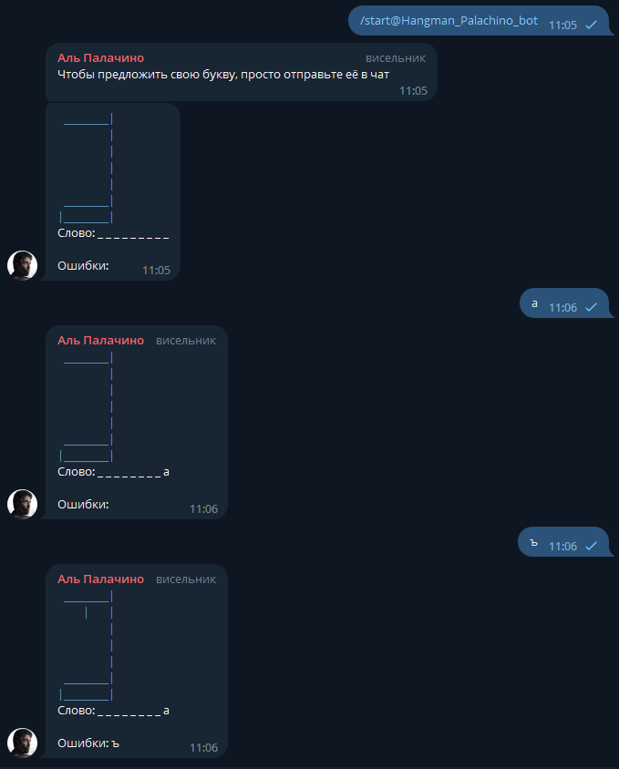

# Учебный проект "Виселица"

Чат-бот, который позволяет играть c друзьями в "Виселицу" через Telegram. 
В учебных целях в проекте использовались Telegarm API, Spring Boot и Spring Data.
В будущем планирую переписать данного бота с использованием паттерна State.

## Установка
1. Заполнить application.propirties в части:

      * имени и токена бота:
	```
	bot.name=*telegramBotName*
	bot.token=*telegramBotToken*
	```
      * используемой СУБД, данных пользователя и диалекта:
	```
	spring.jpa.hibernate.ddl-auto=update
	spring.datasource.url=jdbc:mysql://localhost:3306/hangmanBotDB?createDatabaseIfNotExist=true
	spring.datasource.username=*username*
	spring.datasource.password=*password*
	spring.datasource.dbcp2.driver-class-name=com.mysql.cj.jdbc.Driver
	spring.jpa.database-platform=org.hibernate.dialect.MySQL8Dialect
	spring.jpa.show-sql=true
	spring.main.allow-bean-definition-overriding=true
	```
2. Запустить приложение на локальном сервере, после чего базаданных автоматически заполнится и появится доступ к функционалу чезер соотвествующего телеграм бота.


## Как работает
* командой /start позволяет начать игру;
* командой /delete позволяет закончить начатую игру;
* после старта игры ловит отдельные кирилические буквы до тех пор, пока игра не закончится;
* в групповых чатиках требует доступа к сообщениям для ловли отдельны букв.

